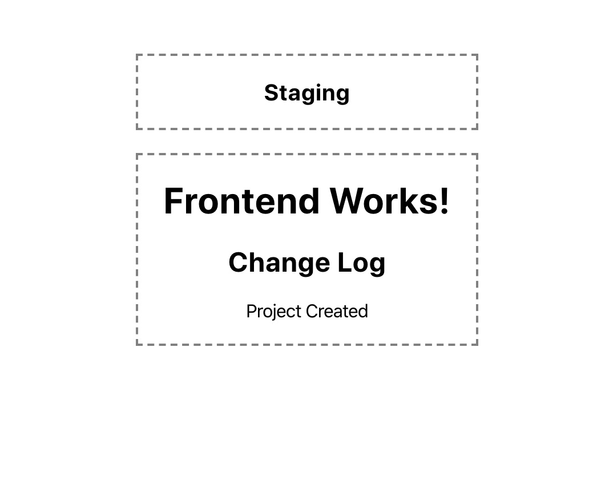

# AppTemplate
Launch a new service on Short Cloud in 10 minutes

## Getting Started

1. Clone this repo.
1. Replace all occurrence of `sampleapp` in `.drone.yml` with the name of your service.
1. Replace all occurrence of `sampleapp` in `k8s` with the name of your service.
1. Remove `.git` and initialize repo with `git init`

   ```bash
   rm -rf .git
   git init
   ```

1. Commit all the change into Git.
   
   ```bash
   git add -A
   git commit -m "Initialize service"
   ```
   
1. Create a repo on Github and push the newly committed changes into it.
1. Sync repos on Drone CI and enable this repo.
1. Set the following secrets for this repo on Drone CI:

   | Secret Name | Secret Value |
   |-------------|--------------|
   | DOCKERHUB_ORG_ID | DockerHub org ID or your username |
   | DOCKERHUB_PASSWORD | DockerHub password | 
   | DOCKERHUB_USERNAME | DockerHub username |
   
1. Create `secrets` directory inside `k8s`.
   
   ```bash
   mkdir k8s/secrets
   ```

1. Create `db-secret.staging.yaml` with the following content and update the secrets with real DB config:

    ```
    apiVersion: v1
    kind: Secret
    metadata:
      name: sampleapp-db
      namespace: staging
    type: Opaque
    data:
      host: db hostname in base 64 format
      port: db port in base 64 format
      user: db user in base 64 format
      password: db password in base 64 format
      name: db name in base 64 format
    ```

1. Create `db-secret.production.yaml` with the following content and update the secrets with real DB config:

    ```
    apiVersion: v1
    kind: Secret
    metadata:
      name: sampleapp-db
      namespace: production
    type: Opaque
    data:
      host: db hostname in base 64 format
      port: db port in base 64 format
      user: db user in base 64 format
      password: db password in base 64 format
      name: db name in base 64 format
    ```
1. Request permission for [DockerHub org](https://hub.docker.com/orgs/shortorg/repositories) and create web hooks for all staging & production images for your service:
   
   | Webhook Name | Webhook URL |
   |--------------|-------------|
   | Keel | https://deploy.short-d.com/v1/webhooks/dockerhub|

1. Request permission for Kubernetes cluster and install `kubectl`.
1. Enable service on Kubernetes:

   ```bash
   ./scripts/deploy
   ```
1. Request permission for `Digitalocean`.
1. [add A records](https://cloud.digitalocean.com/networking/domains) for your service and replace `service_name` with the name of your service:

   | Hostname     | Will Direct To |
   |--------------|----------------|
   | service_name | External |
   | gql-service_name| External |
   | service_name-staging | External |
   | gql-service_name-staging | External |
   
1. Visit `service_name-staging.short-d.com`. You should see the sample site is polling change logs from the backend!

   

1. Create `production` branch.

   ```bash
   git check -b prouduction
   ```

1. Deploy the service onto `production`.

   ```bash
   git push origin -u production
   ```

1. Visit `service_name.short-d.com`. You should see the sample site is running on `production`!

   